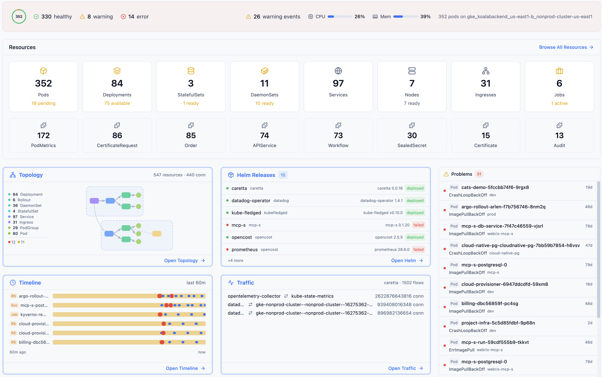

# Skyhook Explorer

[](https://github.com/skyhook-io/explorer/actions/workflows/ci.yml)
[](LICENSE)
[](https://go.dev/)

Real-time Kubernetes cluster visualization and management in your browser.

<p align="center">
  
</p>

## Features

### Cluster Visualization
- **Real-time topology graph** - See pods, deployments, services, and ingresses connected
- **Live event stream** - Watch resource changes as they happen
- **Resource details** - Click any node to see full resource information with YAML editor
- **Multiple view modes** - Traffic view (network path) or Resources view (hierarchy)
- **Change history** - Track resource changes over time with optional persistence

### Pod Operations
- **Terminal access** - Open interactive shell sessions into pods via WebSocket
- **Log streaming** - View and stream pod logs in real-time
- **Container selection** - Choose specific containers in multi-container pods

### Port Forwarding
- **Session management** - Start and stop port forwards from the UI
- **Auto-discovery** - Automatically detect available ports on pods and services
- **Multiple sessions** - Run concurrent port forwards to different targets

### Helm Integration
- **Release management** - View all Helm releases across namespaces
- **Revision history** - Compare manifests between revisions
- **Upgrade & rollback** - Upgrade releases or rollback to previous versions
- **Values inspection** - View computed values for any release

### Additional Features
- **Namespace filtering** - Focus on specific namespaces
- **Platform detection** - Automatic detection of GKE, EKS, AKS, minikube, kind
- **CRD support** - Dynamic discovery and display of Custom Resource Definitions
- **Zero cluster modification** - Read-only by default, no agents to install

## Installation

### Using kubectl plugin (Krew)

```bash
kubectl krew install explorer
kubectl explorer
```

### Using Homebrew (macOS)

```bash
brew install skyhook-io/tap/explorer
skyhook-explorer
```

### Direct Download

Download the latest release from [GitHub Releases](https://github.com/skyhook-io/explorer/releases).

### Docker

```bash
docker run -v ~/.kube:/root/.kube -p 9280:9280 ghcr.io/skyhook-io/explorer
```

## Quick Start

```bash
# Basic usage - opens browser automatically
skyhook-explorer

# Specify namespace
skyhook-explorer --namespace production

# Custom port
skyhook-explorer --port 8080

# Use specific kubeconfig
skyhook-explorer --kubeconfig /path/to/kubeconfig

# Don't auto-open browser
skyhook-explorer --no-browser

# Enable persistent change history
skyhook-explorer --persist-history --history-limit 5000
```

## CLI Options

| Flag | Default | Description |
|------|---------|-------------|
| `--kubeconfig` | `~/.kube/config` | Path to kubeconfig file |
| `--namespace` | _(all)_ | Initial namespace filter |
| `--port` | `9280` | Server port |
| `--no-browser` | `false` | Don't auto-open browser |
| `--dev` | `false` | Development mode |
| `--persist-history` | `false` | Persist change history to file |
| `--history-limit` | `1000` | Maximum changes to retain |
| `--version` | | Show version and exit |

## API Reference

The Explorer exposes a REST API for programmatic access:

### Core Endpoints

| Endpoint | Description |
|----------|-------------|
| `GET /api/health` | Health check with resource counts |
| `GET /api/cluster-info` | Cluster platform and version info |
| `GET /api/topology` | Current topology graph |
| `GET /api/namespaces` | List of namespaces |
| `GET /api/api-resources` | Available API resources (for CRDs) |

### Resource Operations

| Endpoint | Description |
|----------|-------------|
| `GET /api/resources/{kind}` | List resources by kind |
| `GET /api/resources/{kind}/{ns}/{name}` | Get single resource with relationships |
| `PUT /api/resources/{kind}/{ns}/{name}` | Update resource from YAML |
| `DELETE /api/resources/{kind}/{ns}/{name}` | Delete resource |

### Events & History

| Endpoint | Description |
|----------|-------------|
| `GET /api/events` | Recent Kubernetes events |
| `GET /api/events/stream` | SSE stream for real-time events |
| `GET /api/changes` | Resource change history |

### Pod Operations

| Endpoint | Description |
|----------|-------------|
| `GET /api/pods/{ns}/{name}/logs` | Fetch pod logs |
| `GET /api/pods/{ns}/{name}/logs/stream` | Stream logs via SSE |
| `GET /api/pods/{ns}/{name}/exec` | WebSocket terminal session |

### Port Forwarding

| Endpoint | Description |
|----------|-------------|
| `GET /api/portforwards` | List active sessions |
| `POST /api/portforwards` | Start port forward |
| `DELETE /api/portforwards/{id}` | Stop port forward |

### Helm Management

| Endpoint | Description |
|----------|-------------|
| `GET /api/helm/releases` | List all releases |
| `GET /api/helm/releases/{ns}/{name}` | Release details |
| `POST /api/helm/releases/{ns}/{name}/rollback` | Rollback release |
| `DELETE /api/helm/releases/{ns}/{name}` | Uninstall release |

See the [Wiki](../../wiki) for complete API documentation.

## Architecture

```
┌─────────────────┐              ┌───────────────────┐
│    Browser      │◄──HTTP/SSE──►│  Explorer Binary  │
│  (React + UI)   │◄──WebSocket─►│  (Go + Embedded)  │
└─────────────────┘              └───────────────────┘
                                         │
                                ┌────────┴────────┐
                                │   Kubernetes    │
                                │   API Server    │
                                └─────────────────┘
```

The Explorer uses Kubernetes SharedInformers for efficient, watch-based caching. Changes are pushed to the browser via Server-Sent Events (SSE) for real-time updates. Pod terminal access uses WebSocket connections for bidirectional communication.

## Supported Resources

- **Workloads**: Deployments, DaemonSets, StatefulSets, ReplicaSets, Pods, Jobs, CronJobs
- **Networking**: Services, Ingresses
- **Configuration**: ConfigMaps, Secrets (names only)
- **Storage**: PersistentVolumeClaims
- **Autoscaling**: HorizontalPodAutoscalers
- **Cluster**: Nodes, Namespaces
- **Custom**: Any CRD via dynamic discovery

## Development

### Prerequisites

- Go 1.22+
- Node.js 20+
- npm

### Build from Source

```bash
# Clone the repository
git clone https://github.com/skyhook-io/explorer.git
cd explorer

# Build everything (frontend + backend)
make build

# Run
./explorer
```

### Development Mode

Run backend and frontend separately for hot reload:

```bash
# Terminal 1: Backend with hot reload (port 9280)
make watch-backend

# Terminal 2: Frontend with hot reload (port 9273)
make watch-frontend
```

The Vite dev server proxies `/api` requests to the backend automatically.

### Makefile Targets

| Target | Description |
|--------|-------------|
| `make build` | Build frontend + embedded binary |
| `make frontend` | Build frontend only |
| `make backend` | Build backend only |
| `make watch-frontend` | Vite dev server (port 9273) |
| `make watch-backend` | Go with Air hot reload (port 9280) |
| `make test` | Run all tests |
| `make docker` | Build Docker image |

## Documentation

- [Wiki Home](../../wiki) - Full documentation
- [Getting Started](../../wiki/Getting-Started) - Installation and first steps
- [User Guide](../../wiki/User-Guide) - Using the web interface
- [API Reference](../../wiki/API-Reference) - Complete API documentation
- [Development Guide](../../wiki/Development) - Contributing and local setup

## License

Apache 2.0 - see [LICENSE](LICENSE)

## Contributing

Contributions are welcome! Please read our [Contributing Guide](CONTRIBUTING.md) for details.

## Related Projects

- [Skyhook](https://skyhook.io) - The platform for Kubernetes made simple
